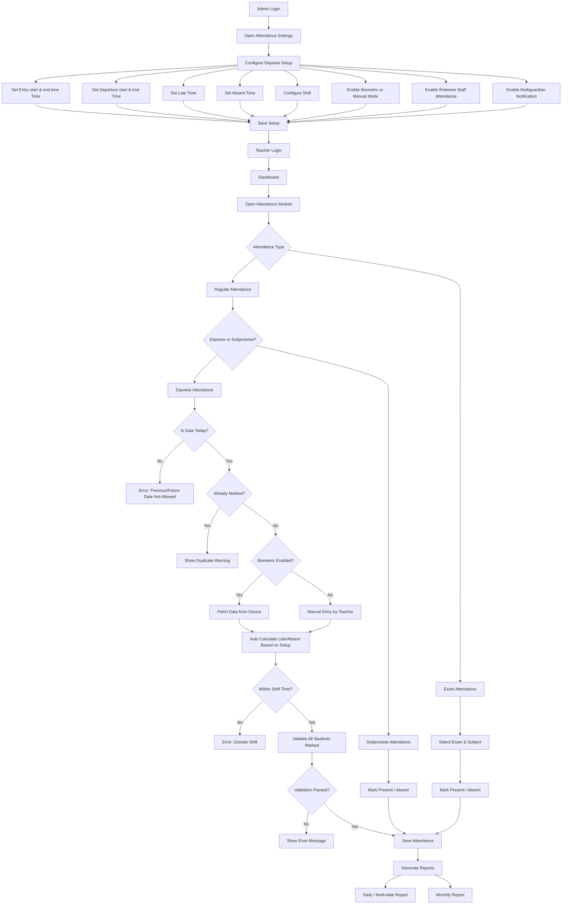

```mermaid
flowchart TD

%% ------------------------
%% ADMIN SETUP SECTION
%% ------------------------

A[Admin Login] --> B[Open Attendance Settings]

B --> C[Configure Daywise Setup]

C --> D[Set Entry start & end time Time]
C --> E[Set Departure start & end Time]
C --> F[Set Late Time]
C --> G[Set Absent Time]
C --> H[Configure Shift]
C --> I[Enable Biometric or Manual Mode]
C --> J[Enable Rolewise Staff Attendance]
C --> K[Enable Multiguardian Notification]

D --> L[Save Setup]
E --> L
F --> L
G --> L
H --> L
I --> L
J --> L
K --> L

%% ------------------------
%% ATTENDANCE MARKING FLOW
%% ------------------------

L --> M[Teacher Login]
M --> N[Dashboard]
N --> O[Open Attendance Module]

O --> P{Attendance Type}

P --> Q[Regular Attendance]
P --> R[Exam Attendance]

%% ------------------------
%% REGULAR ATTENDANCE
%% ------------------------

Q --> S{Daywise or Subjectwise?}

%% DAYWISE FLOW
S --> T[Daywise Attendance]

T --> U{Is Date Today?}
U -- No --> X[Error: Previous/Future Date Not Allowed]
U -- Yes --> V{Already Marked?}

V -- Yes --> Y[Show Duplicate Warning]
V -- No --> Z{Biometric Enabled?}

Z -- Yes --> AA[Fetch Data from Device]
Z -- No --> AB[Manual Entry by Teacher]

AA --> AC[Auto Calculate Late/Absent Based on Setup]
AB --> AC

AC --> AD{Within Shift Time?}
AD -- No --> AE[Error: Outside Shift]
AD -- Yes --> AF[Validate All Students Marked]

AF --> AG{Validation Passed?}
AG -- No --> AH[Show Error Message]
AG -- Yes --> AI[Save Attendance]

%% SUBJECTWISE FLOW
S --> AJ[Subjectwise Attendance]
AJ --> AK[Mark Present / Absent]
AK --> AI

%% EXAM ATTENDANCE
R --> AL[Select Exam & Subject]
AL --> AM[Mark Present / Absent]
AM --> AI

%% REPORTS
AI --> AN[Generate Reports]
AN --> AO[Daily / Multi-date Report]
AN --> AP[Monthly Report]
```